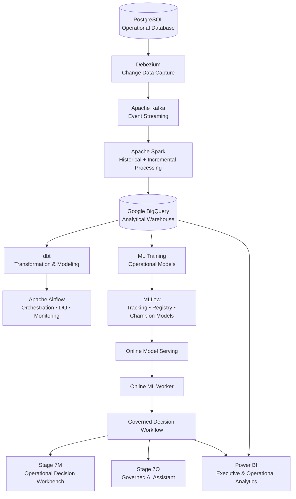

# 💊 PharmStock AI Platform V2

### Production-Oriented Data Engineering, Machine Learning & Governed AI Platform for Pharmacy Operations

<p align="center">
  <strong>CDC Streaming • Large-Scale Data Engineering • MLOps • Online ML • Human-in-the-Loop Decisions • Governed AI • Business Intelligence</strong>
</p>

---

## 🚀 Overview

**PharmStock AI Platform V2** is an end-to-end data engineering and AI platform designed around pharmacy inventory and operational decision-making.

The project demonstrates how transactional data can move through a modern production-oriented architecture — from **Change Data Capture (CDC)** and distributed processing to cloud analytics, machine learning, governed operational workflows, AI-assisted investigation, and executive reporting.

The end-to-end flow is:

```text
PostgreSQL
    ↓
Debezium CDC
    ↓
Apache Kafka
    ↓
Apache Spark
    ↓
Google BigQuery
    ↓
dbt + Apache Airflow
    ↓
ML Training + MLflow Registry
    ↓
Online Model Serving
    ↓
Governed Decision Workflow
    ↓
Operational Workbench + Governed AI Assistant
    ↓
Power BI
```

This is not a notebook-only ML project or a standalone BI dashboard.

The repository implements a connected platform where **data engineering, analytics engineering, MLOps, operational governance, AI assistance, and BI are integrated into one architecture**.

> **Data transparency:** Operational data presented by the platform is synthetic/calibrated and is used for production-style simulation. It does not represent live pharmacy operations.

---

## 🎯 Platform Objectives

PharmStock V2 was designed to address several engineering problems within one system:

- 🔄 Capture operational database changes through **CDC**
- ⚡ Process historical and streaming workloads at scale
- ☁️ Build cloud analytical datasets and curated business models
- 🧪 Apply automated data-quality and operational health checks
- 🤖 Train and manage multiple operational ML models
- 🚀 Serve promoted models for online inference
- 🧠 Convert ML signals into actionable decision cases
- 🛡️ Enforce human approval and role-based operational controls
- 💬 Provide grounded AI assistance with provenance
- 📊 Deliver executive and operational analytics through Power BI

---

# 🏗️ System Architecture

PharmStock V2 follows a layered architecture that separates ingestion, processing, analytics, machine learning, decision governance, AI assistance, and business consumption.



### Architecture Principles

The platform was built around several core engineering principles:

**Event-driven ingestion**  
Operational changes are captured through Debezium and propagated through Kafka rather than relying only on batch extraction.

**Historical + incremental processing**  
Spark supports large-scale historical reconstruction while CDC protects the transition to incremental processing.

**Separation of analytical layers**  
Raw operational history, current-state representations, and curated analytical models are separated rather than mixed into one storage layer.

**Model lifecycle management**  
ML models are tracked and registered through MLflow before being promoted into the serving layer.

**Prediction is not execution**  
A model prediction does not directly trigger a business action. Predictions enter a governed decision workflow.

**Human-in-the-loop governance**  
Operational actions such as approving replenishment drafts remain explicitly controlled.

**Grounded AI**  
The AI assistant operates through governed evidence and provenance rather than unrestricted direct access to operational systems.

---

# 🧱 Platform Layers

| Layer | Technologies | Responsibility |
|---|---|---|
| **Operational Source** | PostgreSQL | Transactional pharmacy data |
| **CDC** | Debezium | Capture database changes |
| **Event Streaming** | Apache Kafka | Durable event transport |
| **Distributed Processing** | Apache Spark | Historical rebuild and incremental processing |
| **Cloud Warehouse** | Google BigQuery | Analytical storage and current-state datasets |
| **Analytics Engineering** | dbt | Curated analytical transformations |
| **Orchestration** | Apache Airflow | Scheduling, DQ and operational monitoring |
| **MLOps** | MLflow | Experiment tracking, registry and model promotion |
| **Model Serving** | Python / API Services | Online inference |
| **Decision Governance** | Governed Workflow + RBAC | Controlled operational actions |
| **AI Assistance** | Governed AI Assistant | Evidence-grounded operational investigation |
| **Business Intelligence** | Power BI | Executive and operational reporting |

---

# 🧠 Governed AI Assistant — Stage 7O

The **Governed AI Assistant** is positioned at the operational decision layer rather than being given unrestricted access to the platform.

It can investigate governed operational evidence while preserving explicit safety boundaries.

### Key capabilities

- 🔎 Stockout-risk investigation
- 📦 Operational inventory context
- 🤖 ML signal interpretation
- 🧾 Evidence provenance
- 🔗 Operational and reference evidence tracking
- 🛡️ Governance-aware responses
- 👤 Human-controlled operational actions

### Explicit governance boundaries

The assistant is intentionally prevented from:

- accessing the operational database directly
- mutating operational data
- selecting suppliers automatically
- creating purchase orders automatically

<p align="center">
  
</p>

<p align="center">
  <em>Governed investigation of stockout risk with evidence provenance and operational safety boundaries.</em>
</p>

---

# 🛡️ Operational Decision Workbench — Stage 7M

ML predictions are converted into governed operational cases rather than directly executed.

The **Stage 7M Operational Decision Workbench** provides the human decision surface for reviewing those cases.

### Governance model

The workbench implements:

- 🔐 API-key authentication
- 👥 Role-Based Access Control (RBAC)
- 👁️ Viewer access
- ⚙️ Operator actions
- 🧑‍💼 Manager approval controls
- 🛡️ Administrative privileges
- 📝 Governed case lifecycle
- ✅ Draft approval
- ❌ Controlled rejection
- 📋 Operational auditability

The workflow follows the principle:

> **Prediction → Decision Case → Human Review → Governed Action**

rather than:

> **Prediction → Automatic Business Action**

<p align="center">
  
</p>

<p align="center">
  <em>Human-in-the-loop operational workbench with governed case actions and role-based controls.</em>
</p>

---
