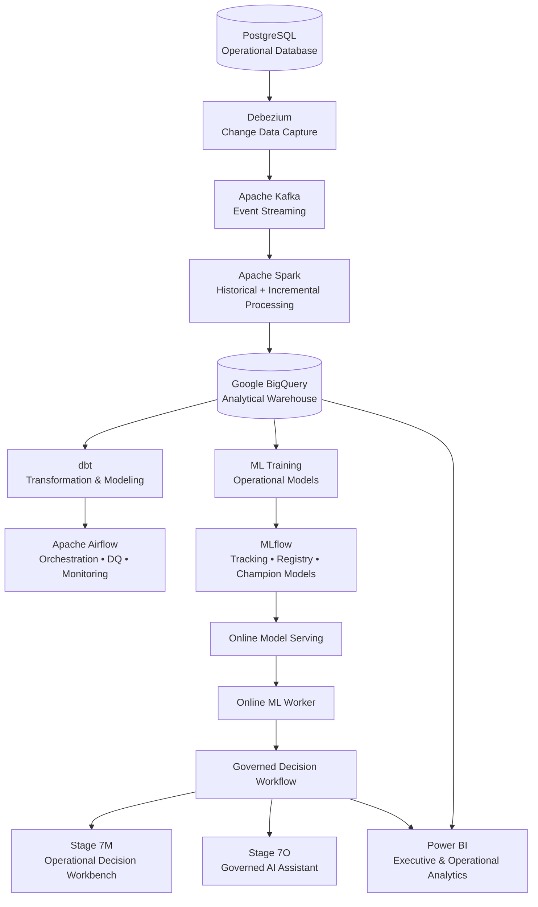
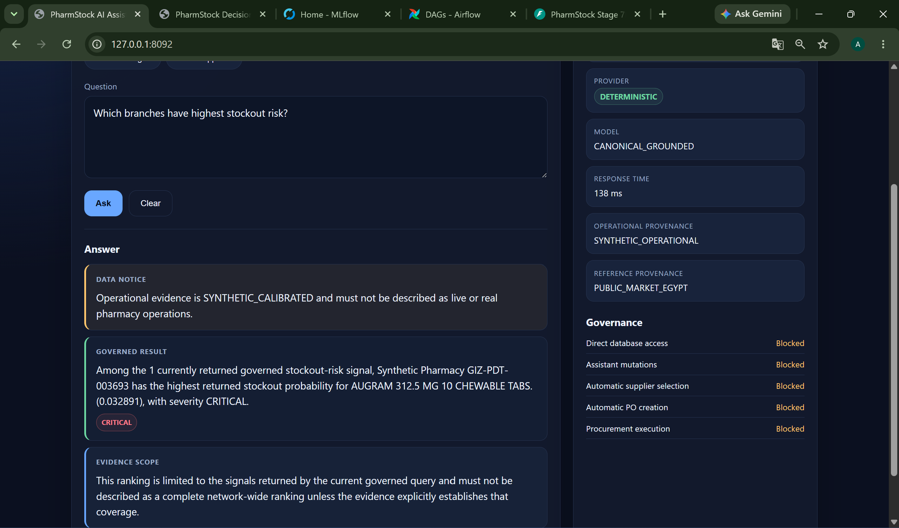
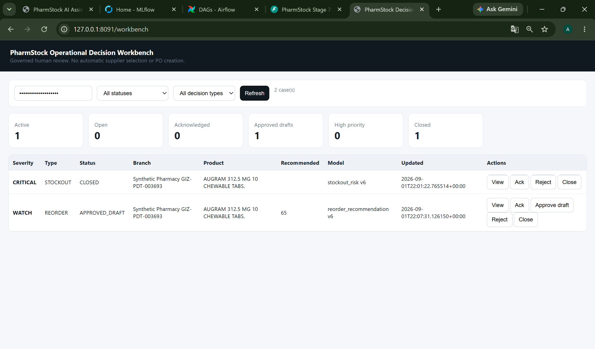
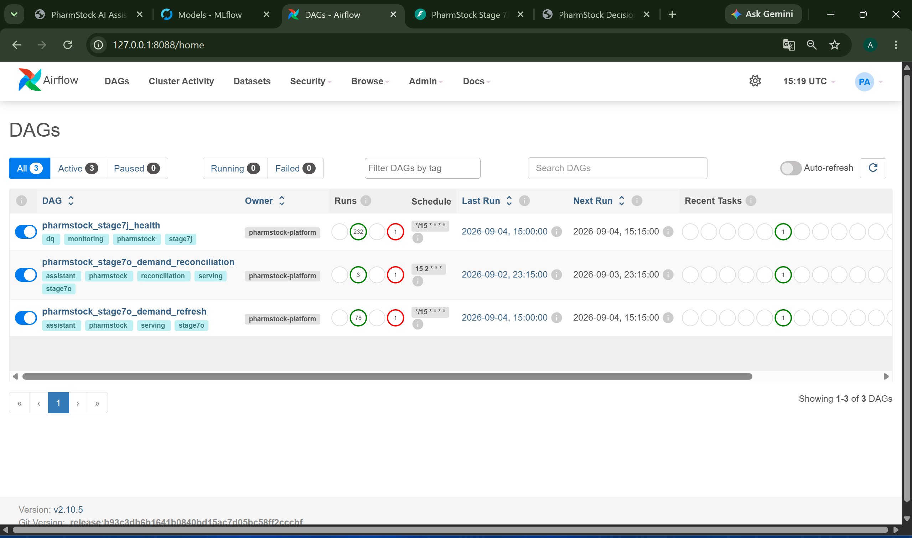
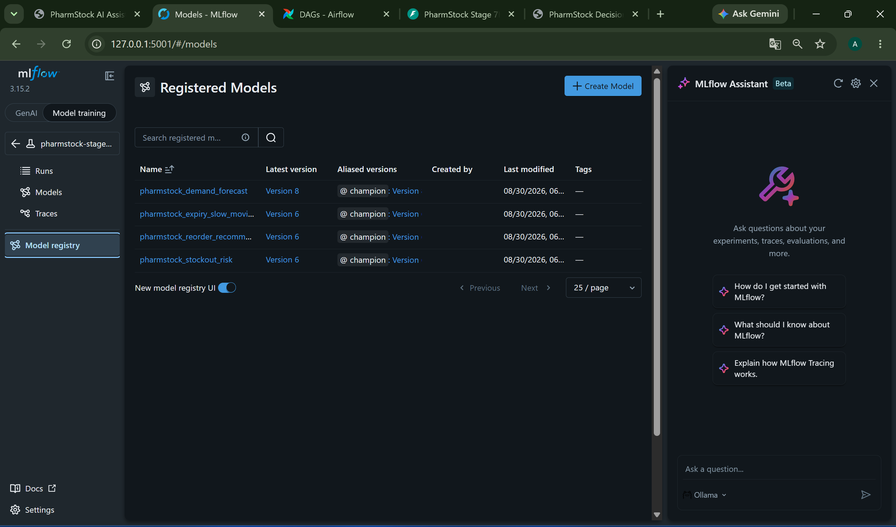
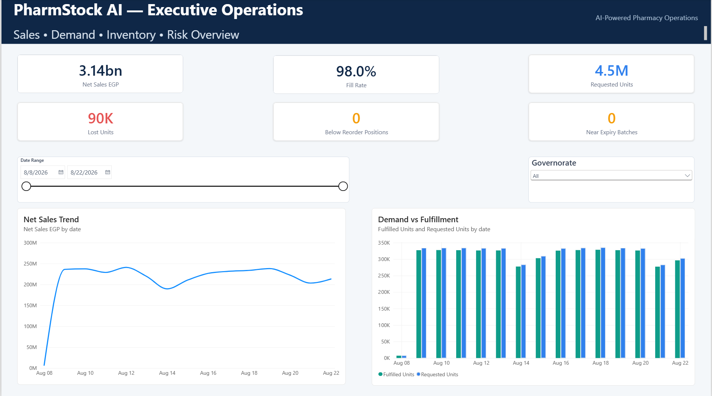
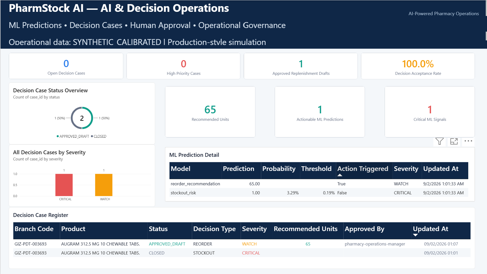

# 💊 PharmStock AI Platform V2

### End-to-End Data Engineering, MLOps & Governed AI for Pharmacy Operations

### Production-Oriented Data Engineering, Machine Learning & Governed AI Platform for Pharmacy Operations

<p align="center">
  <strong>CDC Streaming • Large-Scale Data Engineering • MLOps • Online ML • Human-in-the-Loop Decisions • Governed AI • Business Intelligence</strong>
</p>

---

## 🚀 Overview

**PharmStock AI Platform V2** is an end-to-end data engineering and AI platform designed around pharmacy inventory and operational decision-making.

The project demonstrates how transactional data can move through a modern production-oriented architecture — from **Change Data Capture (CDC)** and distributed processing to cloud analytics, machine learning, governed operational workflows, AI-assisted investigation, and executive reporting.

The end-to-end flow is:

```text
PostgreSQL
    ↓
Debezium CDC
    ↓
Apache Kafka
    ↓
Apache Spark
    ↓
Google BigQuery
    ↓
dbt + Apache Airflow
    ↓
ML Training + MLflow Registry
    ↓
Online Model Serving
    ↓
Governed Decision Workflow
    ↓
Operational Workbench + Governed AI Assistant
    ↓
Power BI
```

This is not a notebook-only ML project or a standalone BI dashboard.

The repository implements a connected platform where **data engineering, analytics engineering, MLOps, operational governance, AI assistance, and BI are integrated into one architecture**.

> **Data transparency:** Operational data presented by the platform is synthetic/calibrated and is used for production-style simulation. It does not represent live pharmacy operations.

---
## 📑 Table of Contents

- [Overview](#-overview)
- [Platform Objectives](#-platform-objectives)
- [System Architecture](#️-system-architecture)
- [Platform Layers](#-platform-layers)
- [Governed AI Assistant](#-governed-ai-assistant--stage-7o)
- [Operational Decision Workbench](#️-operational-decision-workbench--stage-7m)
- [Data Engineering Pipeline](#️-data-engineering-pipeline)
- [Cloud Analytics Layer](#️-cloud-analytics-layer)
- [Orchestration, Data Quality & Monitoring](#-orchestration-data-quality--monitoring)
- [Machine Learning Layer](#-machine-learning-layer)
- [MLOps with MLflow](#-mlops-with-mlflow)
- [Online ML & Model Serving](#-online-ml--model-serving)
- [Governance & Human-in-the-Loop Design](#-governance--human-in-the-loop-design)
- [Business Intelligence](#-business-intelligence--power-bi)
- [Technology Stack](#️-technology-stack)
- [Engineering Highlights](#-engineering-highlights)
- [Repository Structure](#-repository-structure)
- [Running the Platform](#-running-the-platform)
- [Validation Philosophy](#-validation-philosophy)
- [Security & Responsible AI](#️-security--responsible-ai)
- [Data & Deployment Disclaimer](#️-data--deployment-disclaimer)

  
## 🎯 Platform Objectives

PharmStock V2 was designed to address several engineering problems within one system:

- 🔄 Capture operational database changes through **CDC**
- ⚡ Process historical and streaming workloads at scale
- ☁️ Build cloud analytical datasets and curated business models
- 🧪 Apply automated data-quality and operational health checks
- 🤖 Train and manage multiple operational ML models
- 🚀 Serve promoted models for online inference
- 🧠 Convert ML signals into actionable decision cases
- 🛡️ Enforce human approval and role-based operational controls
- 💬 Provide grounded AI assistance with provenance
- 📊 Deliver executive and operational analytics through Power BI

---

# 🏗️ System Architecture

PharmStock V2 follows a layered architecture that separates ingestion, processing, analytics, machine learning, decision governance, AI assistance, and business consumption.



### Architecture Principles

The platform was built around several core engineering principles:

**Event-driven ingestion**  
Operational changes are captured through Debezium and propagated through Kafka rather than relying only on batch extraction.

**Historical + incremental processing**  
Spark supports large-scale historical reconstruction while CDC protects the transition to incremental processing.

**Separation of analytical layers**  
Raw operational history, current-state representations, and curated analytical models are separated rather than mixed into one storage layer.

**Model lifecycle management**  
ML models are tracked and registered through MLflow before being promoted into the serving layer.

**Prediction is not execution**  
A model prediction does not directly trigger a business action. Predictions enter a governed decision workflow.

**Human-in-the-loop governance**  
Operational actions such as approving replenishment drafts remain explicitly controlled.

**Grounded AI**  
The AI assistant operates through governed evidence and provenance rather than unrestricted direct access to operational systems.

---

# 🧱 Platform Layers

| Layer | Technologies | Responsibility |
|---|---|---|
| **Operational Source** | PostgreSQL | Transactional pharmacy data |
| **CDC** | Debezium | Capture database changes |
| **Event Streaming** | Apache Kafka | Durable event transport |
| **Distributed Processing** | Apache Spark | Historical rebuild and incremental processing |
| **Cloud Warehouse** | Google BigQuery | Analytical storage and current-state datasets |
| **Analytics Engineering** | dbt | Curated analytical transformations |
| **Orchestration** | Apache Airflow | Scheduling, DQ and operational monitoring |
| **MLOps** | MLflow | Experiment tracking, registry and model promotion |
| **Model Serving** | Python / API Services | Online inference |
| **Decision Governance** | Governed Workflow + RBAC | Controlled operational actions |
| **AI Assistance** | Governed AI Assistant | Evidence-grounded operational investigation |
| **Business Intelligence** | Power BI | Executive and operational reporting |

---

# 🧠 Governed AI Assistant — Stage 7O

The **Governed AI Assistant** is positioned at the operational decision layer rather than being given unrestricted access to the platform.

It can investigate governed operational evidence while preserving explicit safety boundaries.

### Key capabilities

- 🔎 Stockout-risk investigation
- 📦 Operational inventory context
- 🤖 ML signal interpretation
- 🧾 Evidence provenance
- 🔗 Operational and reference evidence tracking
- 🛡️ Governance-aware responses
- 👤 Human-controlled operational actions

### Explicit governance boundaries

The assistant is intentionally prevented from:

- accessing the operational database directly
- mutating operational data
- selecting suppliers automatically
- creating purchase orders automatically

<p align="center">
  
</p>

<p align="center">
  <em>Governed investigation of stockout risk with evidence provenance and operational safety boundaries.</em>
</p>

---

# 🛡️ Operational Decision Workbench — Stage 7M

ML predictions are converted into governed operational cases rather than directly executed.

The **Stage 7M Operational Decision Workbench** provides the human decision surface for reviewing those cases.

### Governance model

The workbench implements:

- 🔐 API-key authentication
- 👥 Role-Based Access Control (RBAC)
- 👁️ Viewer access
- ⚙️ Operator actions
- 🧑‍💼 Manager approval controls
- 🛡️ Administrative privileges
- 📝 Governed case lifecycle
- ✅ Draft approval
- ❌ Controlled rejection
- 📋 Operational auditability

The workflow follows the principle:

> **Prediction → Decision Case → Human Review → Governed Action**

rather than:

> **Prediction → Automatic Business Action**

<p align="center">
  
</p>

<p align="center">
  <em>Human-in-the-loop operational workbench with governed case actions and role-based controls.</em>
</p>

---
# ⚙️ Data Engineering Pipeline

The data engineering layer is responsible for moving operational pharmacy data from transactional storage into scalable analytical and machine-learning workloads.

## 1. PostgreSQL — Operational Source

PostgreSQL represents the transactional pharmacy system and provides the source data for the platform.

The operational domain includes entities related to:

- products
- inventory
- branches
- sales
- suppliers
- purchasing
- stock movements
- operational reference data

The platform preserves the operational database as the transactional source while downstream components consume changes through controlled ingestion paths.

---

## 2. Debezium — Change Data Capture

Instead of repeatedly extracting complete operational tables, **Debezium CDC** captures database-level changes from PostgreSQL.

```text
INSERT
UPDATE
DELETE
   │
   ▼
PostgreSQL WAL
   │
   ▼
Debezium
   │
   ▼
Kafka Topics
```

This enables the platform to maintain an event-driven representation of operational changes while reducing dependence on repeated full-table batch extraction.

---

## 3. Apache Kafka — Event Streaming

Kafka provides the durable event transport layer between CDC ingestion and downstream processing.

The platform uses dedicated CDC topics to isolate operational change streams and support incremental processing.

### Kafka responsibilities

- durable CDC event transport
- decoupling producers from consumers
- ordered processing within partitions
- replayable event history
- scalable downstream consumption

---

## 4. Apache Spark — Historical & Incremental Processing

Spark handles the distributed processing layer.

The platform supports two complementary workloads:

### Historical reconstruction

Existing PostgreSQL data can be rebuilt into analytical storage without replaying the entire historical dataset through Kafka.

### Incremental CDC processing

After the historical snapshot boundary, new CDC events can be processed incrementally.

This design protects the cutover between:

```text
Historical State
       +
CDC Changes
       ↓
Consistent Analytical State
```

The historical rebuild implementation covers **26 snapshot tables and 13 CDC topics**, with explicit cutover-gap protection and a BigQuery-ready rebuild path. :contentReference[oaicite:0]{index=0}

---

# ☁️ Cloud Analytics Layer

## Google BigQuery

BigQuery provides the analytical warehouse for the cloud-facing portion of PharmStock V2.

The warehouse design separates different responsibilities rather than treating all data as one flat analytical dataset.

```text
Operational Source
       ↓
Raw / Historical Data
       ↓
Current-State Representations
       ↓
Curated Analytical Models
       ↓
ML / BI / Operational Analytics
```

The platform maintains **26 raw tables, 26 current-state views, and curated gold models** while validating CDC integrity and analytical consistency. :contentReference[oaicite:1]{index=1}

---

## dbt — Analytics Engineering

dbt is used to transform warehouse data into governed analytical models.

Its role includes:

- SQL-based transformations
- modular analytical modeling
- reusable business logic
- model dependency management
- testable transformation workflows
- curated datasets for downstream consumers

This creates a clean separation between raw ingestion and business-facing analytical logic.

---

# 🔄 Orchestration, Data Quality & Monitoring

Apache Airflow coordinates recurring operational and analytical workflows.

The orchestration layer covers:

- pipeline scheduling
- health verification
- data-quality checks
- dependency coordination
- demand refresh workflows
- reconciliation workflows
- operational monitoring

The implemented data-quality layer validates conditions such as:

- expected raw table availability
- baseline row counts
- current-state views
- gold analytical models
- duplicate CDC events
- CDC event-store readability
- Debezium connector health
- BigQuery storage guardrails

A validated Stage 7J execution reported **zero duplicate CDC event rows**, all **26 current-state views**, and a healthy Debezium connector. :contentReference[oaicite:2]{index=2}

<p align="center">
  
</p>

<p align="center">
  <em>Airflow orchestration for platform health, demand reconciliation, and demand refresh workflows.</em>
</p>

---

# 🤖 Machine Learning Layer

PharmStock V2 includes multiple operational machine-learning models rather than a single isolated prediction task.

## Operational Models

| Model | Operational Purpose |
|---|---|
| **Demand Forecast** | Estimate future product demand |
| **Stockout Risk** | Identify inventory positions at risk of stockout |
| **Reorder Recommendation** | Support replenishment decision-making |
| **Expiry / Slow-Moving Risk** | Identify inventory exposed to expiry or slow movement |

The models form part of the operational pipeline and feed downstream governed decision processes.

---

# 🧪 MLOps with MLflow

MLflow manages the model lifecycle.

The implementation includes:

- experiment tracking
- training runs
- model artifacts
- model registration
- model versioning
- model comparison
- quality gates
- champion aliases
- controlled model promotion

The serving layer currently validates **4 loaded models and 4 production-ready models** under a strict quality gate. :contentReference[oaicite:3]{index=3}

## 🏆 Champion Model Registry

Promoted models are maintained through the MLflow Model Registry.

<p align="center">
  
</p>

<p align="center">
  <em>Registered operational ML models with versioning and champion aliases.</em>
</p>

This provides an explicit lifecycle:

```text
Training
   ↓
Evaluation
   ↓
Quality Gate
   ↓
MLflow Registry
   ↓
Champion Promotion
   ↓
Model Serving
```

---

# ⚡ Online ML & Model Serving

Promoted models are loaded into a dedicated serving layer for operational inference.

The serving architecture separates:

```text
Model Training
      ↓
Model Registry
      ↓
Model Serving
      ↓
Online ML Worker
      ↓
Operational Prediction
      ↓
Governed Decision Case
```

This prevents model training logic from being directly coupled to operational decision execution.

The online ML worker operates as a separate runtime component and maintains its own health state.

---

# 🔐 Governance & Human-in-the-Loop Design

Governance is a first-class architectural component of PharmStock V2.

The system deliberately separates:

```text
Prediction
    ↓
Recommendation
    ↓
Decision Case
    ↓
Human Review
    ↓
Approval / Rejection
    ↓
Controlled Operational Action
```

## RBAC

Stage 7M implements four operational roles:

| Role | Intended Responsibility |
|---|---|
| **Viewer** | Read operational cases |
| **Operator** | Operational acknowledgement and case handling |
| **Manager** | Higher-authority review and approval |
| **Admin** | Administrative operational authority |

Authorization follows a **deny-by-default** approach.

## Safety Boundaries

The platform intentionally blocks uncontrolled automation in sensitive procurement operations.

Examples include:

- automatic purchase-order creation is disabled
- automatic supplier selection is disabled
- AI direct database access is disabled
- AI operational mutations are blocked
- human approval remains required for governed actions

These controls are architectural decisions rather than UI-only restrictions.

---

# 📊 Business Intelligence — Power BI

Power BI provides the final analytical and operational consumption layer.

The report combines traditional business KPIs with ML and governed-decision information.

## Executive Operations

The executive view provides consolidated visibility into:

- net sales
- demand
- fill rate
- lost units
- inventory exposure
- reorder requirements
- expiry risk
- sales trends
- branch-level performance

<p align="center">
  
</p>

<p align="center">
  <em>Executive pharmacy operations view covering sales, demand, inventory and risk.</em>
</p>

---

## 🤖 AI & Decision Operations

The AI & Decision Operations page connects machine-learning outputs with governed operational workflows.

It exposes:

- ML predictions
- critical ML signals
- decision cases
- actionable predictions
- decision acceptance
- human approval
- operational governance
- replenishment drafts
- detailed prediction context

<p align="center">
  
</p>

<p align="center">
  <em>Integrated ML, human approval, decision governance, and operational monitoring.</em>
</p>

---

# 🐳 Containerized Runtime

The platform is packaged as a multi-service Docker environment.

Core runtime services include:

```text
PostgreSQL
Kafka
Debezium / Kafka Connect
Spark
MLflow
Model Serving
Online ML Worker
Governed Workflow
Stage 7M API / Workbench
Stage 7O AI Assistant
Airflow Scheduler
Airflow Webserver
Airflow Metadata Database
Operational Dashboard
```

A validated runtime snapshot showed the Stage 7O assistant, Stage 7M API, Stage 7L workflow, online ML worker, model-serving service, MLflow, PostgreSQL, Kafka, Airflow, Spark and supporting services running together. :contentReference[oaicite:4]{index=4}

---

# 🛠️ Technology Stack

| Domain | Technologies |
|---|---|
| **Programming** | Python, SQL |
| **Transactional Database** | PostgreSQL |
| **CDC** | Debezium |
| **Streaming** | Apache Kafka |
| **Distributed Processing** | Apache Spark |
| **Cloud Warehouse** | Google BigQuery |
| **Analytics Engineering** | dbt |
| **Orchestration** | Apache Airflow |
| **Machine Learning** | Python ML stack |
| **MLOps** | MLflow |
| **API Layer** | FastAPI |
| **Governance** | RBAC, API Keys, Human Approval Workflow |
| **AI Layer** | Governed AI Assistant |
| **Business Intelligence** | Power BI |
| **Containerization** | Docker / Docker Compose |
| **Version Control** | Git / GitHub |

---

# 📈 Engineering Highlights

Some of the key implementation characteristics of the platform include:

- **26** historical snapshot tables
- **13** CDC topics
- **26** current-state analytical views
- **4** operational ML models
- **4** production-ready served models
- MLflow model registry with champion aliases
- CDC cutover-gap protection
- duplicate CDC-event validation
- Airflow orchestration and monitoring
- online ML inference
- governed operational decision workflow
- four-role RBAC model
- human approval boundaries
- provenance-aware AI assistance
- executive and AI-oriented Power BI reporting

---

# 🧩 End-to-End Operational Flow

A simplified example of how a stockout signal moves through the platform:

```text
1. Inventory transaction occurs in PostgreSQL
                     ↓
2. Debezium captures the database change
                     ↓
3. Kafka transports the CDC event
                     ↓
4. Spark processes historical/incremental state
                     ↓
5. BigQuery analytical state is updated
                     ↓
6. ML evaluates operational risk
                     ↓
7. Online ML emits a prediction
                     ↓
8. Governed workflow creates a decision case
                     ↓
9. Operator / Manager reviews the case
                     ↓
10. Governed action is approved or rejected
                     ↓
11. AI Assistant can investigate supporting evidence
                     ↓
12. Power BI exposes operational and executive outcomes
```

This flow demonstrates the core principle of the platform:

> **Data → Intelligence → Governed Decision → Human-Controlled Action**

---

# 📁 Repository Structure

The repository is organized by platform responsibility, with engineering, analytics, machine learning, orchestration, governance, and BI components separated into dedicated modules.

```text
pharmstock-ai-platform-v2/
│
├── airflow/                  # Airflow runtime and orchestration support
├── dags/                     # Airflow DAG definitions
├── dbt/                      # Analytics engineering and warehouse transformations
├── docs/                     # Project documentation
│   └── assets/
│       └── screenshots/      # README platform screenshots
│
├── infra/                    # Docker and infrastructure configuration
├── ml/                       # ML training, registry and serving components
├── operations/               # Operational governance and AI layers
├── powerbi/                  # Power BI model / reporting assets
├── scripts/                  # Execution, validation and checkpoint scripts
├── spark/                    # Spark processing jobs
├── src/                      # Core PharmStock Python packages
├── tests/                    # Automated tests
└── warehouse/                # Warehouse-related assets and definitions

> The exact repository structure evolves with the platform. Historical implementation notes and development artifacts are intentionally kept away from the primary repository landing experience.

---

# 🚀 Running the Platform

PharmStock V2 is a multi-service platform and requires several local and cloud dependencies.

## Prerequisites

Typical prerequisites include:

- Git
- Docker Desktop / Docker Engine
- Docker Compose
- Python
- Google Cloud credentials for cloud-backed stages
- BigQuery project configuration
- Power BI Desktop for local BI development

Clone the repository:

```bash
git clone https://github.com/ayadigiliansDE/pharmstock-ai-platform.git
cd pharmstock-ai-platform
```

The platform is implemented incrementally through validated stages and checkpoint scripts.

Before running cloud-backed components, configure the required environment variables and credentials for your environment.

> ⚠️ Do not commit API keys, Google Cloud credentials, service-account files, or other secrets to the repository.

---

# ✅ Validation Philosophy

PharmStock V2 uses checkpoint-based validation rather than assuming that successful container startup means the complete platform is healthy.

Validation covers multiple layers, including:

- service health
- CDC connectivity
- historical rebuild integrity
- analytical state
- data-quality checks
- model availability
- model quality gates
- online worker heartbeat
- governed workflow health
- authentication
- RBAC
- AI governance boundaries

For example, the validated runtime reports Stage 7O as healthy with Stage 7M healthy underneath it, while Stage 7M reports Stage 7L healthy and procurement writes blocked. :contentReference[oaicite:5]{index=5} :contentReference[oaicite:6]{index=6}

---

# 🛡️ Security & Responsible AI

This repository demonstrates architectural security and governance controls, but it should not be interpreted as a complete regulatory or production-security certification.

Implemented controls include:

- role-based authorization
- API-key protected operational endpoints
- deny-by-default action authorization
- human approval requirements
- blocked automatic procurement execution
- blocked direct database access from the AI assistant
- evidence provenance
- explicit synthetic-data disclosure

A real production deployment would additionally require organization-specific controls such as secret management, identity federation, network isolation, encryption policies, centralized audit infrastructure, regulatory review, disaster recovery, and formal security testing.

---

# ⚠️ Data & Deployment Disclaimer

The project uses **synthetic/calibrated operational data** for engineering and production-style simulation.

It is designed as a **production-oriented / deployment-ready reference architecture**, but the repository should not be interpreted as evidence that the system is currently operating against live pharmacy production data.

Machine-learning predictions, replenishment recommendations, dashboards, and AI outputs in the repository are therefore demonstrations of the platform architecture and workflow.

---

# 🎯 Project Scope

PharmStock AI Platform V2 demonstrates an integrated implementation across:

**Data Engineering → Streaming → Cloud Analytics → Analytics Engineering → MLOps → Online ML → Decision Governance → Governed AI → Business Intelligence**

The objective is not simply to predict pharmacy demand.

The objective is to demonstrate how a prediction can travel through a controlled engineering system and become a **traceable, explainable, human-governed operational decision**.

---

## 📸 Platform Evidence

| Component | Evidence |
|---|---|
| 🤖 Governed AI | Stage 7O AI Assistant |
| 🛡️ Decision Governance | Stage 7M Operational Workbench |
| 🧪 MLOps | MLflow Champion Model Registry |
| 🔄 Orchestration | Airflow Operational DAGs |
| 📊 Executive Analytics | Power BI Executive Operations |
| 🧠 AI Operations | Power BI AI & Decision Operations |

All screenshots shown above are captured from the implemented PharmStock V2 environment.

---

## 📌 Status

**Current platform milestone: Stage 7O — Governed AI Assistant**

Core end-to-end capabilities implemented:

**CDC → Streaming → Distributed Processing → Cloud Analytics → ML → Online Inference → Governed Decisions → AI Assistance → BI**

---

<p align="center">
  <strong>PharmStock AI Platform V2</strong><br/>
  <em>From operational events to governed intelligence.</em>
</p>
