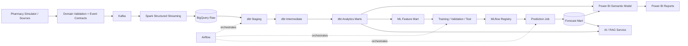

# PharmStock AI Platform V2 — Target Architecture

## 1. Architectural goal

V2 separates responsibilities instead of coupling analytics, machine learning, data processing, and user interfaces in one application.

The primary rule is:

**Every layer has a clear contract, owns one responsibility, and can be tested independently.**

## 2. Target data flow



## 3. Layer boundaries

### Domain
Owns business concepts such as Product, Pharmacy, Inventory, Sale, Restock, Stock Movement and versioned event contracts.
It must not know Kafka, Spark, BigQuery, Power BI or MLflow. Inventory mutations are immutable transitions and domain events remain transport-independent.

### Ingestion
Creates/receives valid domain events and publishes them to the event bus.
It does not contain analytics or dashboard logic.

### Streaming
Consumes events, performs streaming-safe validation/enrichment, and writes authoritative raw records and operational alerts.

### Warehouse / dbt
Turns raw data into documented, tested analytical models. Power BI and ML consume curated marts rather than arbitrary files.

### Power BI
Owns semantic modelling, measures and reports. It consumes curated warehouse models; it is not responsible for ETL/business-event processing.

### ML
Consumes time-aware feature marts, performs leakage-safe train/validation/test evaluation, logs runs/models, and writes predictions back to a serving mart.

### AI / RAG
Runs as an independent service/API. It may retrieve approved curated data and forecasts, but it is not embedded inside the BI processing path.

### Airflow
Coordinates scheduled/batch workflows. It does not replace Kafka or Spark streaming.

### Observability
Structured logs, metrics, health checks, data-quality tests and alerts span the platform.

## 4. Key V2 design decisions

1. The original repository remains unchanged and is used only as reference.
2. Python code is a real installable package under `src/pharmstock`.
3. Event contracts are defined before Kafka integration.
4. Schemas/events will be versioned from the start.
5. Power BI reads curated marts/semantic models instead of Streamlit-local Parquet fallbacks.
6. ML evaluation uses chronological holdout boundaries to prevent data leakage.
7. Predictions are persisted to a warehouse mart so BI does not invoke model code directly.
8. RAG/AI is decoupled from the BI dashboard and exposed through an API boundary.
9. Secrets are never committed; `.env.example` contains names/placeholders only.
10. External service/image/dependency versions will be pinned before production deployment.

## 5. Stage 0 deliberately does NOT implement

- Kafka brokers/topics/producers
- Spark jobs
- BigQuery schemas
- dbt models
- Power BI model/report
- XGBoost/MLflow
- Vector database/RAG
- Airflow DAG logic
- Cloud deployment

Those are later stages. Stage 0 only makes the boundaries explicit so later code has a correct home.

## 6. Implemented local streaming/analytics boundary through Stage 4B

The current local implementation now makes the streaming boundary concrete:

```text
Operational simulator artifacts
        -> versioned domain events
        -> Kafka
        -> Stage 4A Spark Structured Streaming
        -> source-faithful Bronze Parquet + envelope quarantine
        -> Stage 4B Spark Silver full refresh
        -> typed event tables + duplicate/conflict/reject audit
```

Bronze identity is Kafka `(topic, partition, offset)`. Silver identity is the domain
`event_id`. BigQuery and dbt will consume the normalized contracts introduced here rather
than bypassing them with direct reads from simulator CSV files.


## Warehouse boundary (Stage 5A)
Stage 4B Silver remains the normalized source of truth. Stage 5A introduces a BigQuery-oriented
warehouse contract without making the local development path depend on a cloud account. Spark
validates and rewrites the seven Silver tables into warehouse-ready Parquet, then deterministic
contracts generate BigQuery schemas, partitioning/clustering policy, and load plans. Real cloud
loading is an explicit optional action, not a side effect of local acceptance.


## Stage 5C Analytics Layer

`pharmstock_silver` -> dbt staging views (`pharmstock_stg`) -> ephemeral intermediate models -> governed Gold tables (`pharmstock_gold`) -> Power BI. Master-data dimensions remain deferred until authoritative master snapshots are published to BigQuery.


## Stage 5D — Master dimensions

The analytics warehouse now has an explicit `pharmstock_master` layer feeding dbt dimensions
`dim_product`, `dim_branch`, and `dim_supplier`. Product origin is U.S. openFDA; pharmacy and
supplier entities remain synthetic and are labeled as such.

## Power BI serving boundary

Power BI consumes `pharmstock_pbi`, not internal Silver/Gold datasets directly. The
serving layer exposes four dimensions, four facts, and three aggregate marts. The
semantic contract uses one-to-many single-direction relationships and explicit DAX
measures. Monetary analytics remain disabled until authoritative monetary data exists.

## Stage 6B — Power BI Desktop semantic model

Stage 6B turns the Stage 6A serving contract into a deterministic Desktop authoring kit.
Power BI Desktop remains authoritative for the PBIX/PBIP file. The model uses Import,
four dimensions, explicit one-to-many single-direction relationships, explicit DAX
measures, and no monetary analytics until an authoritative monetary source exists.

## Stage 7A — Egypt-oriented pharmaceutical truth boundary

The production expansion introduces a stricter source classification model:

```text
OFFICIAL_EGYPT
    EDA EDDB / authorized EDA exports or APIs

PUBLIC_MARKET_EGYPT
    real public Egyptian-market observations with source + license + snapshot provenance

SYNTHETIC_CALIBRATED
    simulation-only values used when no suitable real/public value exists
```

The Stage 7A default product and retail-price source is classified as
`PUBLIC_MARKET_EGYPT`. It is never presented as an EDA registry export. EDA registration number,
GTIN, license status and official price verification remain pending until verified against an
authorized EDA source. This allows the simulator and later financial model to use realistic Egypt
market products/prices without weakening regulatory provenance.

## Stage 7D — On-premises operational source-of-record boundary

The production-like flow now begins with a real database boundary rather than simulator CSV files:

```text
POS / Operational services
        ↓
PostgreSQL 18.6 (pharmstock_ops)
        ├─ master
        ├─ commercial
        ├─ pos
        ├─ inventory
        └─ procurement
        ↓ logical WAL / pgoutput
Debezium CDC (Stage 7F)
        ↓
Kafka → Spark → BigQuery → dbt → Power BI / ML / AI
```

Stage 7A/7B/7C artifacts bootstrap master/commercial state. From Stage 7E onward, operational
transactions are written to PostgreSQL first so replacing the synthetic POS writer with a real
pharmacy integration does not require redesigning the downstream streaming/warehouse platform.

## Stage 7F — Debezium CDC into Kafka

Stage 7F deploys Kafka Connect with Debezium PostgreSQL CDC against the Stage 7D/7E source of
record. The connector uses `pgoutput`, the pre-created `pharmstock_cdc_publication`, and the
canonical `pharmstock_cdc_slot`. Table changes are emitted to `pharmstock.ops.<schema>.<table>`
topics.

The checkpoint intentionally uses `snapshot.mode=no_data`. This prevents the 13+ GB local
PostgreSQL history from being re-emitted as millions of snapshot events merely to prove CDC. The
Stage 7G rebuild owns the controlled historical load into Spark/BigQuery; Stage 7F owns the
ongoing change stream from the source database.

```text
Stage 7E PostgreSQL history ────────────────┐
                                             ├─ Stage 7G controlled rebuild
new PostgreSQL WAL → Debezium → Kafka ─────┘
```


## Stage 7G — Controlled large-scale rebuild

Stage 7G separates bulk history from ongoing CDC. It captures Kafka high-watermark offsets, reads
the Stage 7E operational history directly from PostgreSQL with Spark JDBC, captures a second Kafka
boundary, and consumes exactly the CDC range that overlapped the snapshot. Changed CDC-managed
tables are reconciled by primary key and the ending offsets become the resume point. The local
checkpoint writes BigQuery-ready Parquet and a rebuild plan without mutating cloud resources.


## Stage 7H — BigQuery rebuild deployment + dbt analytics

Stage 7H consumes the accepted Stage 7G Parquet package. The local checkpoint is cloud-safe.
Explicit cloud execution stages and validates all 26 tables before promotion into
`pharmstock_ops_rebuild`; row counts and primary keys are checked before any final replacement.
Stage 7H then runs a dedicated dbt rebuild namespace (`rebuild_staging`, `rebuild_intermediate`,
`rebuild_marts`) and preserves the Stage 7G CDC resume offsets for the later continuous stream.
Historical Stage 7E rows are never replayed through Kafka as part of this deployment.

## Stage 7N Power BI production serving boundary

Power BI now consumes a governed hybrid serving layer rather than raw warehouse or operational
schemas. Historical/current warehouse analytics are exposed as views in `pharmstock_pbi_prod`;
ML and human-decision state are exposed through read-only PostgreSQL `bi` views. The BI database
role cannot mutate procurement, ML, workflow, inventory or master data. The initial Desktop model
uses Import mode; Power BI Service publication will require a gateway for the local PostgreSQL
source until final cloud deployment.
